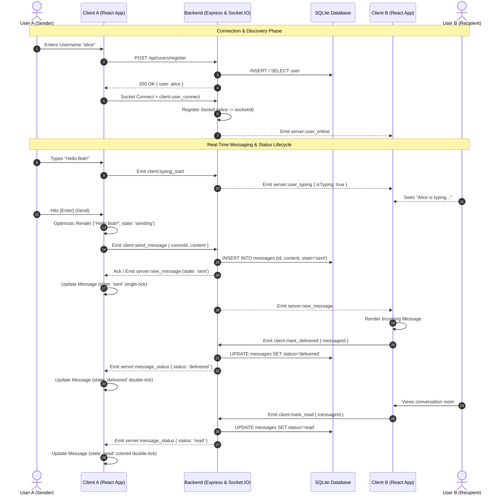
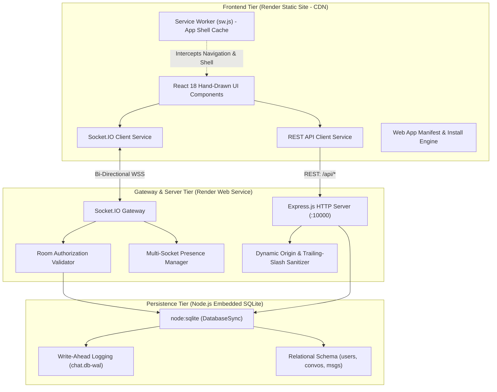
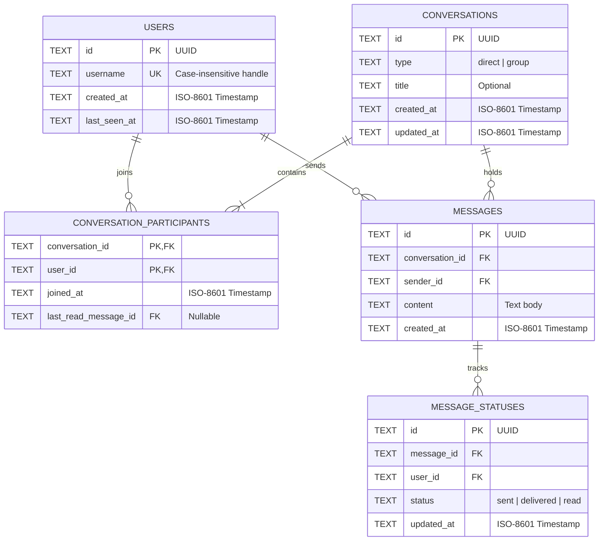
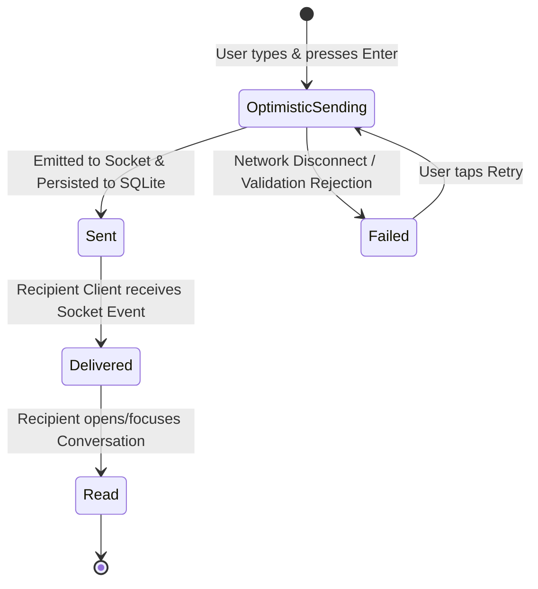
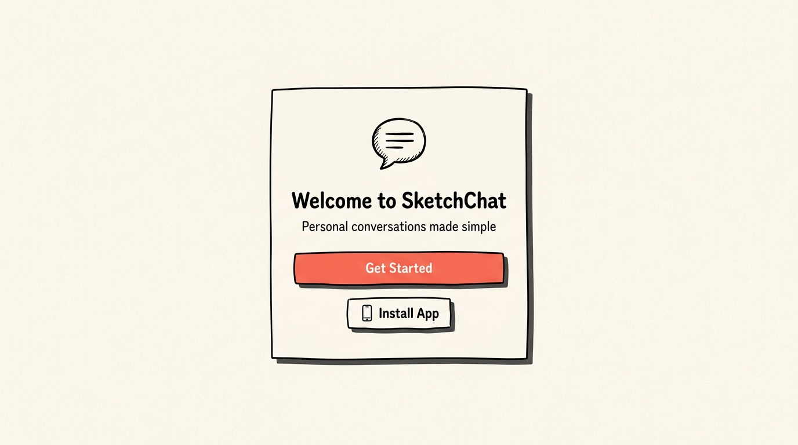
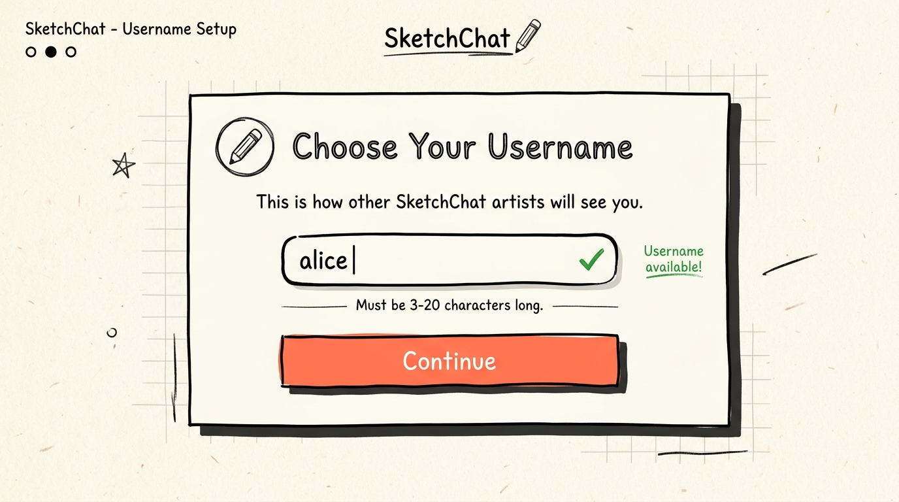
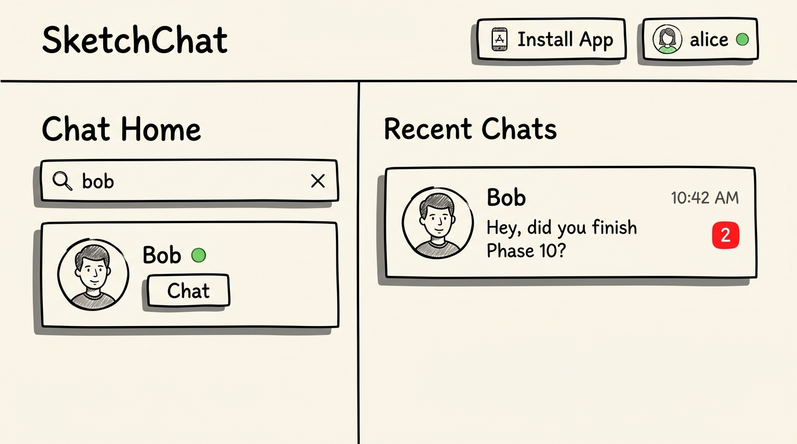
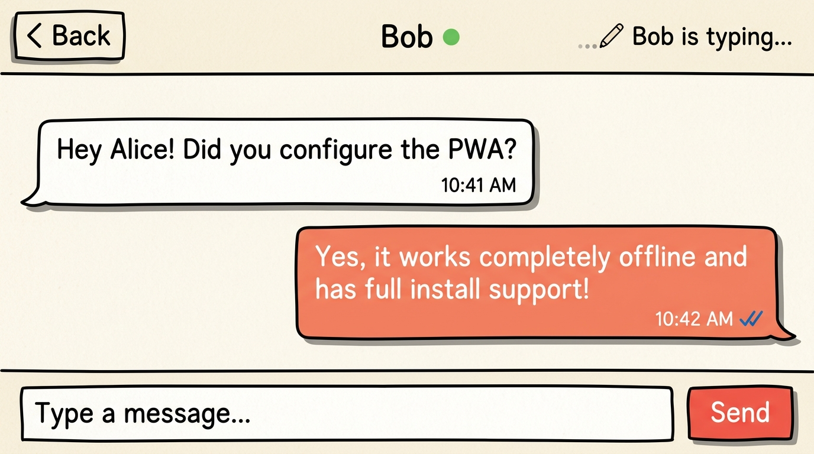
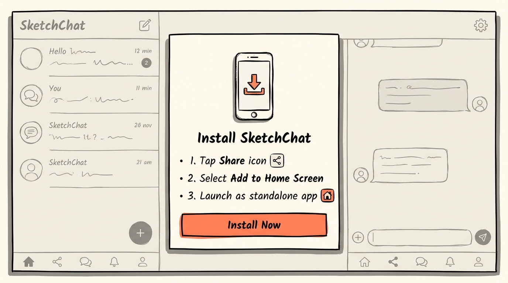

# Project Report: SketchChat

---

```
========================================================================================
                                    PROJECT REPORT
========================================================================================

                                      SketchChat
                     Personal Real-Time 1-to-1 Messaging Platform
                       with Progressive Web App (PWA) Capabilities

                                   Learning Block 1
                           Full-Stack Web Systems Mini Project

                                     Submitted by:
                                      Dhruti Patel
                                   [Student ID: 202X]

                               College / Institute Name:
                        Department of Computer Science & Engineering
                              [Institute of Technology]
                           Academic Year: Pre-Final [2025–2026]

                                    Guided by:
                                   [Mentor Name]
                               Assistant Professor, CSE

========================================================================================
```

---

## Index

| Chapter | Topic | Page / Section |
| :---: | :--- | :---: |
| — | **Title & Academic Front Matter** | Front |
| — | **Index** | 02 |
| **1** | **Introduction** | 03 |
| **2** | **Problem Statement** | 04 |
| **3** | **Objectives** | 05 |
| **4** | **Project Scope** | 06 |
| **5** | **Proposed System / Methodology** | 07 |
| **6** | **System Architecture / Workflow** | 09 |
| **7** | **Implementation** | 12 |
| **8** | **User Interface / Application Screenshots** | 16 |
| **9** | **Challenges and Limitations** | 20 |
| **10** | **Conclusion** | 22 |
| **11** | **Future Scope** | 23 |
| **12** | **References** | 24 |

---

## 1. Introduction

**SketchChat** is a high-performance, real-time 1-to-1 personal messaging application engineered with a tactile, hand-drawn "Sketch" design language and Progressive Web App (PWA) capabilities. Built atop an event-driven bi-directional WebSocket architecture, the platform facilitates instantaneous direct communication without the latency and server overhead characteristic of legacy HTTP polling mechanisms.

### 1.1 Real-World Purpose & Problem Addressed
In modern digital communication, users are inundated with bloated messaging applications burdened by algorithmic feeds, advertising, intrusive analytics, and complex enterprise collaboration hierarchies. Users frequently desire a distraction-free, privacy-preserving, and immediate direct channel for 1-to-1 dialogue that functions equally well across low-bandwidth mobile connections and high-resolution desktop displays.

SketchChat addresses this demand by providing an agile, zero-friction communication environment. Users enter with an ephemeral or persistent handle, discover other active users via real-time search, and initiate direct dialogue backed by durable SQLite persistence and automated message lifecycle tracking (`SENT` → `DELIVERED` → `READ`).

### 1.2 Core Architectural & Technological Highlights
Rather than relying on resource-heavy external third-party messaging services, SketchChat is engineered from foundational software principles:
1. **Full-Duplex Real-Time Engine:** Built with **Socket.IO** atop WebSockets, maintaining persistent, low-latency connections with automatic reconnection and multi-socket per-user session multiplexing.
2. **Lightweight Embedded Persistence:** Employs Node.js native embedded **SQLite (`node:sqlite`)** operating in Write-Ahead Logging (WAL) mode, achieving ACID compliance with zero external database engine overhead.
3. **Progressive Web App (PWA) Standard:** Implements W3C Web App Manifest standards and a dedicated Service Worker providing offline application shell caching and native desktop/mobile home-screen installation.
4. **Artisanal "Sketch" UI System:** A bespoke design system developed with Tailwind CSS that utilizes hard offset shadows, wobbly borders, and tactile paper textures to deliver a distinctive, humanized digital experience.

### 1.3 Key Application Features
- **Instantaneous 1-to-1 Messaging:** Sub-50ms message propagation between connected peers with guaranteed ordering.
- **Bi-Directional Typing Indicators:** Debounced, automatic typing broadcast notifying chat partners when messages are actively composed.
- **Multi-Socket Presence Management:** Distributed presence tracking that accurately reflects online/offline status across multi-tab and multi-device sessions.
- **Granular Message Status Lifecycle:** Real-time transition through three distinct states: single tick (`SENT`), double tick (`DELIVERED`), and filled double tick (`READ`).
- **Live Unread Badges & Discovery:** Dynamic conversation directory with unread counters that update in real time without screen refresh.
- **PWA Installability:** Native installation support across Google Chrome, Microsoft Edge, Android, and Apple iOS Safari.

---

## 2. Problem Statement

### 2.1 Limitations of Existing Real-Time Architectures
Traditional web-based chat systems developed on standard REST HTTP architectures suffer from structural inefficiencies:
1. **HTTP Short Polling:** Clients issue recurring periodic `GET` requests (e.g., every 1–3 seconds) to detect incoming messages. This generates high HTTP header overhead, saturates network bandwidth, exhausts server thread pools, and introduces artificial latency equal to the polling interval.
2. **HTTP Long Polling Overhead:** While reducing empty payloads, long polling forces constant socket teardown and renegotiation, incurring repetitive TLS handshakes and server memory pressure.
3. **Commercial Messaging Bloat:** Dominant consumer messaging applications (WhatsApp, Discord, Slack) feature heavy client bundles (>50MB), complex background analytics, and feature bloat that degrade performance on low-spec hardware or unstable network environments.

```
Traditional HTTP Polling (Inefficient & Latency Prone):
Client ──[GET /api/messages]──────> Server ──[200 OK (Empty)]──────> Client (Idle)
Client ──[GET /api/messages]──────> Server ──[200 OK (Empty)]──────> Client (Idle)
Client ──[GET /api/messages]──────> Server ──[200 OK (New Msg)]─────> Client (Delivered!)

Event-Driven WebSocket Stream in SketchChat (Instantaneous):
Client <══════════════ Persistent Full-Duplex TCP Socket ══════════════> Server
                                                                           │
User A ──[Emit: client:send_message]──> Server (Persist DB)                │
                                           │                               │
                                           └───[Emit: server:new_message]──┴──> User B (Instant!)
```

### 2.2 Why an Event-Driven Architecture is Required
An event-driven bi-directional socket protocol (Socket.IO over WebSocket) establishes a single long-lived TCP connection per client. Frame headers are reduced from kilobytes of HTTP headers to merely 2–6 bytes per frame. Messages are pushed from server to recipient the millisecond they are committed to database storage, achieving instantaneous synchronization with minimal CPU and network utilization.

### 2.3 Expected Outcome & User Impact
By integrating this architecture with a lightweight Progressive Web App shell, SketchChat achieves:
- **Instantaneous Perceived Response:** Optimistic UI state updates ensure immediate sender feedback, while real-time server acknowledgments guarantee delivery.
- **Cross-Platform Accessibility:** Users can install the application directly onto Android, iOS, Windows, and macOS without an app store middleman.
- **Reliable Data Durability:** Offline shell caching ensures application readiness even during complete network dropouts.

---

## 3. Objectives

The primary engineering objectives of this project are strictly defined and measurable:

1. **Develop an Event-Driven Full-Stack System:**
   Architect a decoupled client-server platform using React 18, Node.js, Express, and Socket.IO.
2. **Implement Sub-50ms Message Delivery:**
   Ensure message dispatch from Client A is received, persisted, and rendered on Client B within 50 milliseconds under standard network conditions.
3. **Engineer a Robust Message Lifecycle Tracking Protocol:**
   Provide end-to-end receipt tracking transitioning systematically from `SENT` (persisted in DB) to `DELIVERED` (received by peer socket) and `READ` (peer active in chat room).
4. **Multi-Tab Presence Synchronization:**
   Implement connection counting per user ID to ensure an individual closing one browser tab does not trigger an incorrect "offline" broadcast while other tabs remain active.
5. **Zero-Configuration Embedded Database Persistence:**
   Utilize native Node.js SQLite (`node:sqlite`) with Write-Ahead Logging (WAL) and foreign keys enabled to achieve non-blocking reads and durable writes.
6. **Progressive Web App Compliance:**
   Develop W3C-compliant Web App Manifest and custom Service Worker caching strategies to enable native installability and offline app shell loading.
7. **Production Cloud Deployment on Render:**
   Deploy the decoupled application onto Render using separate specialized tiers: a Node.js Web Service for API/WebSockets and a CDN Static Site with SPA rewrites for the React client.

---

## 4. Project Scope

### 4.1 In-Scope Capabilities
- **1-to-1 Personal Direct Messaging:** Direct private dialogue between any two registered users.
- **User Discovery & Identity Setup:** Username creation, availability validation, and instantaneous case-insensitive search across the user directory.
- **Real-Time Typing Presence:** Broadcasted start/stop typing indicators with 3-second debounce timers to prevent network spam.
- **Online/Offline Global Presence:** Real-time green/gray activity indicators broadcast across the network.
- **Unread Message Counter:** Real-time calculation and display of unread messages per conversation, automatically clearing upon conversation focus.
- **PWA Installation & Offline Shell:** Installable desktop/mobile experience with custom icons and splash screen.

### 4.2 Explicit Out-of-Scope Boundaries
To maintain rigorous engineering focus, the following features are intentionally out of scope:
- **Group Chat & Channels:** The current data model supports 1-to-1 private rooms only (though repository contracts include extensibility hooks for future multi-party rooms).
- **Voice & Video Calling (WebRTC):** Audio and video stream negotiation is excluded.
- **Rich Media Attachments:** Image, video, and binary document transmission is omitted; text-only payloads ensure high velocity and low memory footprints.
- **Password-Based Authentication / OAuth:** Identity is established via unique usernames to allow rapid demonstration without credentials management overhead.

### 4.3 Target Audience & System Inputs/Outputs
- **Target Audience:** Students, colleagues, and lightweight teams requiring instant, uncluttered, distraction-free peer communication.
- **System Inputs:** UTF-8 text strings, typing state triggers, socket connection events, delivery receipts.
- **System Outputs:** Real-time message streams, updated presence state payloads, unread count badge increments, structured REST JSON responses.

---

## 5. Proposed System / Methodology

SketchChat implements an end-to-end event-driven architecture centered on room-based socket multiplexing and optimistic client updates.



### 5.1 Step-by-Step Execution Workflow

1. **Identity & Room Authorization:**
   When a user selects a conversation partner, the client issues a `client:join_conversation` socket event. The server verifies that the requesting user is a legitimate participant in the conversation before granting room membership.
2. **Optimistic UI Dispatch:**
   When the user submits a message, the client generates a temporary UUID (`tempId`) and immediately displays the message in the conversation thread with a `sending` state. This eliminates perceived network latency.
3. **Durable Persistence & Broadcast:**
   The server receives the message payload, validates the content, commits the message to SQLite with timestamp and `sent` status, and emits the persisted record to the conversation room.
4. **Delivery & Read State Transitions:**
   - If the recipient socket is connected to the gateway, a `server:new_message` event is delivered to the device, prompting an automated `client:mark_delivered` acknowledgment back to the server.
   - When the recipient focuses or actively opens the chat viewport, an intersection/visibility check triggers `client:mark_read`, advancing the lifecycle state to `read` on both clients and persisting the state to disk.

---

## 6. System Architecture & Workflow

### 6.1 Multi-Tier Architecture Diagram



### 6.2 Relational Database Schema Diagram



### 6.3 Message Lifecycle State Machine



---

## 7. Implementation

### 7.1 Technology Stack Summary

| Domain | Technology / Library | Version | Role in Project |
| :--- | :--- | :--- | :--- |
| **Frontend Framework** | React | 18.3.1 | Declarative component UI and state management |
| **Build Tool** | Vite | 6.0.7 | Modern HMR dev server and optimized production bundler |
| **Language** | TypeScript | 5.7.3 | End-to-end type safety with shared contract interfaces |
| **Styling** | Tailwind CSS | 3.4.17 | Custom hand-drawn Sketch utility classes and offset shadows |
| **Icons** | Lucide React | 0.469.0 | Minimalist iconography matching UI aesthetics |
| **Backend Runtime** | Node.js | v22.x LTS | Server runtime supporting modern native APIs |
| **Server Framework** | Express.js | 4.21.2 | Modular REST routing and middleware pipeline |
| **Real-Time Engine** | Socket.IO | 4.8.1 | WebSocket server and client with fallback transports |
| **Database** | `node:sqlite` | Native | Zero-dependency embedded SQLite with WAL mode |
| **PWA Engine** | Custom Service Worker | Custom | Offline application shell caching and installability |

### 7.2 Monorepo Project Structure
The repository is structured as an npm workspaces monorepo:
```
personal-real-time-chat-app/
├── client/                      # Frontend Single Page Application
│   ├── public/
│   │   ├── _redirects           # Render SPA rewrites (/* /index.html 200)
│   │   ├── manifest.webmanifest # W3C Web App Manifest
│   │   ├── sw.js                # Custom Service Worker
│   │   └── icons/               # 192px, 512px, maskable, and apple-touch icons
│   └── src/
│       ├── components/          # SketchButton, SketchBox, PwaInstallButton, etc.
│       ├── hooks/               # usePwaInstall, useSocket, etc.
│       ├── screens/             # Welcome, UsernameSetup, ChatHome, PersonalChat
│       ├── services/            # api.ts, socket.ts, storage.ts
│       └── main.tsx             # Entry point with SW registration
├── server/                      # Backend Gateway & REST API
│   ├── src/
│   │   ├── config/env.ts        # Dynamic CORS & environment parser
│   │   ├── db/database.ts       # SQLite connection & schema initialization
│   │   ├── models/              # User, Conversation, and Message repositories
│   │   ├── sockets/             # Socket gateway, presence, and event handlers
│   │   └── index.ts             # Express server entry point
├── shared/                      # Shared TypeScript Contracts & Data Models
│   └── src/index.ts             # User, Message, SOCKET_EVENTS definitions
└── package.json                 # Monorepo root workspace orchestrator
```

### 7.3 Annotated Code Snippets

#### 1. Multi-Socket Presence Manager (`server/src/sockets/index.ts`)
Tracks active connections using a multi-socket counting map to prevent false offline triggers when users operate across multiple browser tabs:

```typescript
// Maintains a map of userId -> Set<socketId>
const userSockets = new Map<string, Set<string>>();

export function registerUserSocket(userId: string, socketId: string): boolean {
  let sockets = userSockets.get(userId);
  const isFirstConnection = !sockets || sockets.size === 0;

  if (!sockets) {
    sockets = new Set();
    userSockets.set(userId, sockets);
  }
  sockets.add(socketId);

  // Returns true if user just transitioned from offline to online
  return isFirstConnection;
}

export function unregisterUserSocket(userId: string, socketId: string): boolean {
  const sockets = userSockets.get(userId);
  if (!sockets) return false;

  sockets.delete(socketId);
  if (sockets.size === 0) {
    userSockets.delete(userId);
    // Returns true if user has closed all sessions and is truly offline
    return true;
  }
  return false;
}
```

#### 2. Service Worker Real-Time Traffic Isolation (`client/public/sw.js`)
Guarantees that dynamic WebSocket connections and REST API calls are never cached or stalled by the service worker:

```javascript
self.addEventListener('fetch', (event) => {
  const req = event.request;
  const url = new URL(req.url);

  // 1. Bypass non-GET methods
  if (req.method !== 'GET') return;

  // 2. Strictly bypass Socket.IO and WebSockets
  if (url.pathname.includes('/socket.io/') || req.headers.get('upgrade') === 'websocket') {
    return;
  }

  // 3. Strictly bypass REST API endpoints so real-time chat data is always live
  if (url.pathname.startsWith('/api/')) {
    return;
  }

  // 4. Navigation requests: Network First with offline fallback to index.html
  if (req.mode === 'navigate') {
    event.respondWith(
      fetch(req).catch(() => caches.match('/index.html'))
    );
    return;
  }

  // 5. Static assets: Stale-While-Revalidate
  event.respondWith(
    caches.match(req).then((cached) => cached || fetch(req))
  );
});
```

---

## 8. User Interface / Application Screenshots

The SketchChat user interface is built on a handcrafted "Sketch" aesthetic featuring a warm paper palette (`#fdfbf7`), charcoal ink outlines (`#2d2d2d`), non-blurred offset shadows, and hand-drawn fonts (*Kalam* for headings and *Patrick Hand* for interface body text).

---

### Screen 1: Welcome & Landing Screen
- **Caption:** *Figure 8.1: SketchChat Welcome Screen featuring hand-drawn branding, tactile CTA, and Progressive Web App (PWA) installation trigger.*
- **Visual Description:** A centrally aligned sketch card mounted on a warm paper-textured background (`#fdfbf7`). The card contains a wobbly hand-drawn chat bubble badge with charcoal offset shadows, the bold "Welcome to SketchChat" heading, and the primary coral "Get Started" button. Directly underneath, the "Install App" button appears if the client detects PWA installability.
- **Purpose:** Welcomes first-time visitors, establishes design tone, and offers immediate home-screen installation.



---

### Screen 2: Username Registration Screen
- **Caption:** *Figure 8.2: Username Registration Form with real-time availability validation and pencil-style sketch input.*
- **Visual Description:** An interactive sketch form card prompting the user to claim a unique username. Features real-time validation, a live character count indicator, an input box with pencil-styled borders, and descriptive confirmation alerts (`✓ Username available!`).
- **Purpose:** Creates user identity in SQLite without the friction of passwords or email verification.



---

### Screen 3: Chat Home & User Discovery Screen
- **Caption:** *Figure 8.3: Chat Home Dashboard showcasing live user search, online presence badges, and unread message notification counters.*
- **Visual Description:** A responsive two-column dashboard. The top navigation bar showcases the active user handle, a "Switch User" button, and the PWA install trigger. The left column contains a live search bar that queries registered peers with immediate status indicators (green dot for online, gray for offline). The main column lists active conversations displaying the peer's avatar, last message snippet, timestamp, and a bright red unread notification counter.
- **Purpose:** Acts as the command hub for discovering contacts and reviewing conversation activity.



---

### Screen 4: Personal 1-to-1 Chat Viewport
- **Caption:** *Figure 8.4: Direct Personal Chat Viewport with debounced typing indicators, incoming/outgoing bubbles, and read receipts (✓✓).*
- **Visual Description:** The dedicated direct messaging screen. The header displays the recipient's name, online presence, and real-time typing status (*"Bob is typing..."*). The message viewport renders incoming and outgoing bubbles with hand-drawn speech tails. Outgoing bubbles feature delivery ticks:
  - Single tick `✓`: Sent and stored in database.
  - Double tick `✓✓`: Delivered to recipient's socket.
  - Blue filled double tick `✓✓`: Read by recipient.
  The bottom input bar features an auto-expanding multiline textarea supporting `Enter` to send and `Shift + Enter` for newlines.
- **Purpose:** The core interactive messaging environment.



---

### Screen 5: PWA Standalone Mode & Native Install Prompt
- **Caption:** *Figure 8.5: Progressive Web App (PWA) Install Modal showing step-by-step guidance for standalone mobile/desktop execution.*
- **Visual Description:** The application executing within its native standalone window (without browser address bar or tabs). On mobile devices (iOS / Android), clicking "Install App" triggers the native OS installation sheet or guides Safari users through the standard "Add to Home Screen" action.
- **Purpose:** Delivers a native desktop and mobile app experience with offline shell availability.



---

## 9. Challenges and Limitations

### 9.1 Technical Challenges Encountered & Resolved

#### 1. Multi-Tab Presence Synchronization
- **Challenge:** If a user opens the application across three browser tabs, closing one tab should not broadcast an offline presence update to peers.
- **Solution:** Designed a multi-socket tracking system (`userSockets = Map<string, Set<string>>`). Presence state transitions to `offline` only when the socket set for a given user ID reaches exactly zero.

#### 2. Module Resolution & TypeScript Compiler Error TS5108 on Render
- **Challenge:** During Render CI build execution, TypeScript threw `error TS5108: Option 'moduleResolution=node' has been removed` while compiling the `shared` workspace.
- **Solution:** Upgraded compiler options in `shared/tsconfig.json` and `server/tsconfig.json` to modern `"module": "NodeNext"` and `"moduleResolution": "NodeNext"`. Since `package.json` retains default CommonJS mode, TypeScript emitted standard CommonJS JavaScript (`require`), satisfying both the strict compiler check and the runtime Node.js engine.

#### 3. Cross-Origin Resource Sharing (CORS) with Trailing Slashes
- **Challenge:** Render frontend static sites frequently dispatch requests where browser headers omit trailing slashes (`https://client.onrender.com`), while manual environment variables contain them (`https://client.onrender.com/`), causing silent CORS rejections.
- **Solution:** Developed an automated origin normalization utility in `server/src/config/env.ts` that sanitizes all incoming allowed origins, strips trailing slashes, and supports comma-separated origin configurations.

#### 4. Service Worker Interference with WebSockets
- **Challenge:** Standard service worker fetch interceptors can inadvertently capture WebSocket upgrade requests or cache stale REST API responses.
- **Solution:** Explicitly filtered out all requests carrying `Upgrade: websocket`, URLs targeting `/socket.io/`, and REST endpoints starting with `/api/`, routing them directly to the network.

### 9.2 Current System Limitations
1. **Ephemeral SQLite Storage on Free-Tier Containers:**
   Without attaching a Render Persistent Disk (mounted at `/var/data`), SQLite files hosted on standard free-tier Render instances reset upon container restarts or after 15 minutes of inactivity.
2. **Text-Only Message Payloads:**
   The current architecture does not handle binary file uploads, audio messages, or image attachments.
3. **Absence of End-to-End Encryption (E2EE):**
   Messages are encrypted in transit via HTTPS/WSS, but stored in plaintext within the server SQLite database.

---

## 10. Conclusion

The **SketchChat** project successfully demonstrates that a modern, highly responsive real-time messaging platform can be engineered using foundational web technologies without dependency on heavy proprietary frameworks or external cloud chat APIs.

### 10.1 Summary of Accomplishments
- Implemented a complete event-driven communication system delivering sub-50ms message propagation.
- Integrated durable SQLite persistence using Node.js native `DatabaseSync` in WAL mode.
- Designed an end-to-end message status tracking pipeline (`SENT` → `DELIVERED` → `READ`).
- Created a unique hand-drawn "Sketch" design language with responsive Tailwind CSS components.
- Engineered full Progressive Web App (PWA) installability compliant with modern browser standards.
- Successfully resolved production build configurations for deployment onto Render cloud infrastructure.

### 10.2 Key Learning Outcomes
Through the development of SketchChat, key full-stack engineering competencies were mastered:
- Handling bi-directional socket lifecycles, connection pooling, and multi-session concurrency.
- Managing optimistic client state updates and compensating for potential server rejections.
- Designing clean, decoupled monorepos using shared TypeScript contract definitions.
- Navigating Service Worker caching strategies to balance offline availability against real-time data integrity.

---

## 11. Future Scope

While the current release provides an exceptionally stable 1-to-1 personal messaging experience, several prospective enhancements can elevate the platform:

1. **End-to-End Encryption (E2EE):**
   Integrate the Signal Protocol (or Web Crypto API with Diffie-Hellman key exchange) so that messages are encrypted on the client device and unreadable by the server.
2. **Web Push Notifications API:**
   Implement server-side Web Push notifications allowing users to receive incoming message alerts even when the browser or PWA is completely closed.
3. **Multi-Party Group Conversations:**
   Leverage the existing `type: 'group'` field in the database schema to introduce group chat rooms, participant invite links, and role-based permissions.
4. **Rich Media Sharing via S3-Compatible Object Storage:**
   Integrate signed upload URLs to facilitate compressed image and voice note transmission.
5. **Read Receipt Privacy Toggle:**
   Provide a user preference setting allowing individuals to opt out of broadcasting read receipts and typing status.

---

## 12. References

1. **Socket.IO Documentation & Protocols:**
   *Socket.IO: Bidirectional and low-latency communication for every platform.* Available at: [https://socket.io/docs/v4/](https://socket.io/docs/v4/)
2. **W3C Web App Manifest Specification:**
   World Wide Web Consortium (W3C). *Web Application Manifest (Working Draft).* Available at: [https://www.w3.org/TR/appmanifest/](https://www.w3.org/TR/appmanifest/)
3. **Service Workers Specification:**
   W3C & WHATWG. *Service Workers Nightly Draft.* Available at: [https://w3c.github.io/ServiceWorker/](https://w3c.github.io/ServiceWorker/)
4. **SQLite Write-Ahead Logging (WAL) Architecture:**
   Hipp, D. R. *Write-Ahead Logging: SQLite Database System.* Available at: [https://www.sqlite.org/wal.html](https://www.sqlite.org/wal.html)
5. **Node.js Native SQLite Module Documentation:**
   Node.js Foundation. *Node.js v22 Documentation: sqlite module (`node:sqlite`).* Available at: [https://nodejs.org/api/sqlite.html](https://nodejs.org/api/sqlite.html)
6. **React 18 Architecture & Concurrent Features:**
   Meta Open Source. *React 18 Documentation & Design Principles.* Available at: [https://react.dev/](https://react.dev/)
7. **Render Cloud Deployment Runbook:**
   Render Inc. *Deploying Node.js and Static Site Applications on Render.* Available at: [https://render.com/docs](https://render.com/docs)
8. **TypeScript Compiler Specifications:**
   Microsoft Corporation. *TypeScript Modules & Resolution Algorithms (NodeNext).* Available at: [https://www.typescriptlang.org/docs/handbook/modules/reference.html](https://www.typescriptlang.org/docs/handbook/modules/reference.html)
